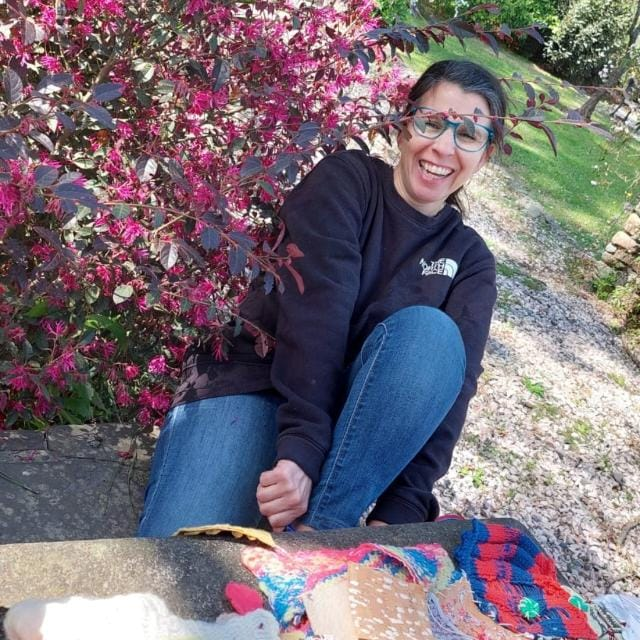

# Sobre mi

Soy Paola Maldonado, artista, diseñadora e investigadora de materiales, vinculada a los biomateriales desde 2015. Tengo principal interés en la revalorización de diferentes recursos así como también en el trabajo con distintas fibras naturales. Actualmente llevo adelante el Club de Biomateriales junto a Paula Díaz.

